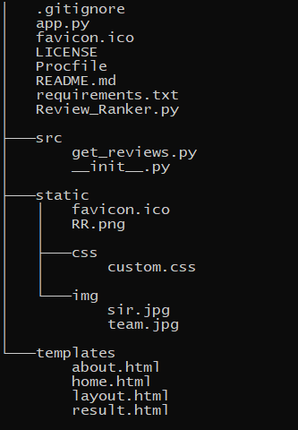

<h1 align="center">Reviews-Ranker</h1>

## About

Deploying **reviews-ranker** using flask application and hosting on Heroku. For detail understanding of how our project was developed please visit [Capstone-Review-Ranker](https://github.com/veeravignesh1/Capstone-Reviews-Ranker) Repo.

## Folder Structure



## Learnings during App Development

- `Procfile` is case sensitive. Named it `PROCFILE` and pushed to Github. Correcting it locally and pushing to Github changed the contents inside the file and not the file name. Had to delete the file and reupload.
- Opening Chrome instance each time through the loop is time consuming as driver bootup itself takes 3s approx. So it took **6 Mins** to scrape 20 pages
- Made Chrome driver to reuse the session and open a new url in the same tab of the opened chrome browser. All driver parameters are defined outside the loop and an instance of the browser is opened outside the loop and then command is passed to driver to execute with the `url`. `_self` reuses the tab of the browser. `_blank` opens a new tab on the browser. Code to execute script is as below.  Huge speed gains.

`driver.execute_script('window.open("{}","_self");'.format(url))`

- Browser window can be set with many options one was `--headless` which opens the chrome driver without actually opening. Said to have speed gains in larger tasks.

- `bs4` and `scrapy` can interact with javascript elements. In the current project chose selenium because of its ability to interact with the screen. During review scraping had to find all the `readmore` elements and click it. After clicking the view has to scrolled in.

  ```python
  for rm in read_more_btns:
              driver.execute_script("return arguments[0].scrollIntoView();", rm)
              driver.execute_script("window.scrollBy(0, -150);")
              rm.click()
  ```

- Selenium has a built-in capability to wait until page load. but can be ensured by waiting until a particular class element is found in the page. Was useful to check whether all the page contents is loaded properly. Two types of waits `implicit` - waits for specified amount of time even if the element is loaded before it. and `explicit` wait waits upto the specified time before throwing time out error.

- Used `df.to_html()` along with some bootstrap classes, but on page render `\n`was literally displayed instead of rendering as new line. used inbuild replace command to change the content to `<br>`

  ```python
  df.to_html(columns=["Some_Col"],index=False,classes=			["table","tablehover"],header=False).replace('\\n','<br>')
  ```

## Learnings during App Deployment

- [Video for adding vars in heroku environment ](https://www.youtube.com/watch?v=Ven-pqwk3ec)

- Chrome Driver and Chrome Driver was added as a buildpack during development
  - [Google Chrome](https://github.com/heroku/heroku-buildpack-google-chrome)
  - [Chrome driver](https://github.com/heroku/heroku-buildpack-chromedriver)
- A application process should end within 30s are else heroku will give application error. On submit our app crawls the data before giving useful result to the user. So limited scrapping of webpages to 4. 
  - To overcome this Multiprocessing or Multithreading can be used (Trying to Implement)
  - Redis, rq can be used to queue the process which the user provides (Trying to Implement)
- Adding marketplace apps needs credit card to avoid misuse.

- Heroku gives 5 sites upload for free. GCP provides free credits for students to deploy models. (Must try..)

